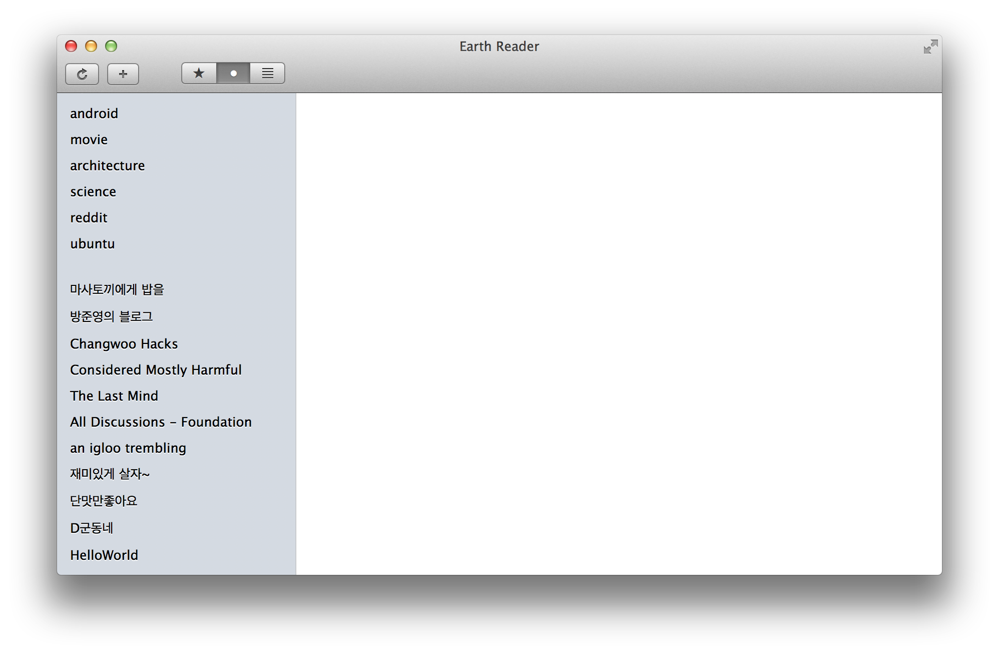

Earth Reader for Mac
====================

`Earth Reader`_ is a news reader that runs on various devices and
is synchronized without any particular centralized proprietary
services.

Earth Reader for Mac is a native Mac app of Earth Reader.  It currently
is heavily under development.  You need Python 3.3 or higher to try it out.
You can run it by the following instruction:

.. code-block:: bash

   $ python3 setup.py py2app
   $ dist/Earth\ Reader.app/Contents/MacOS/Earth\ Reader

Licensed under GPLv3_ or later.

.. _Earth Reader: http://earthreader.org/
.. _GPLv3: http://www.gnu.org/licenses/gpl-3.0.html
